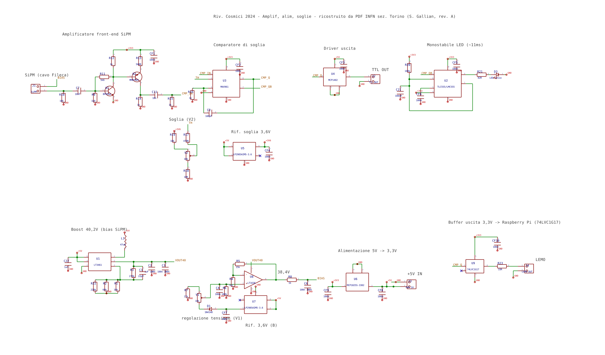
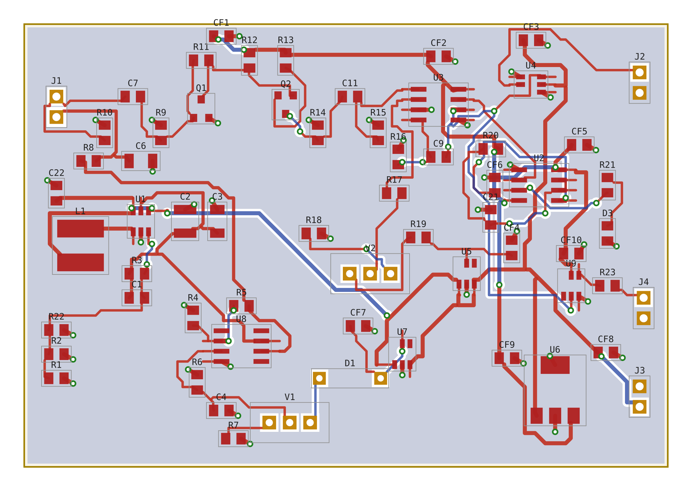
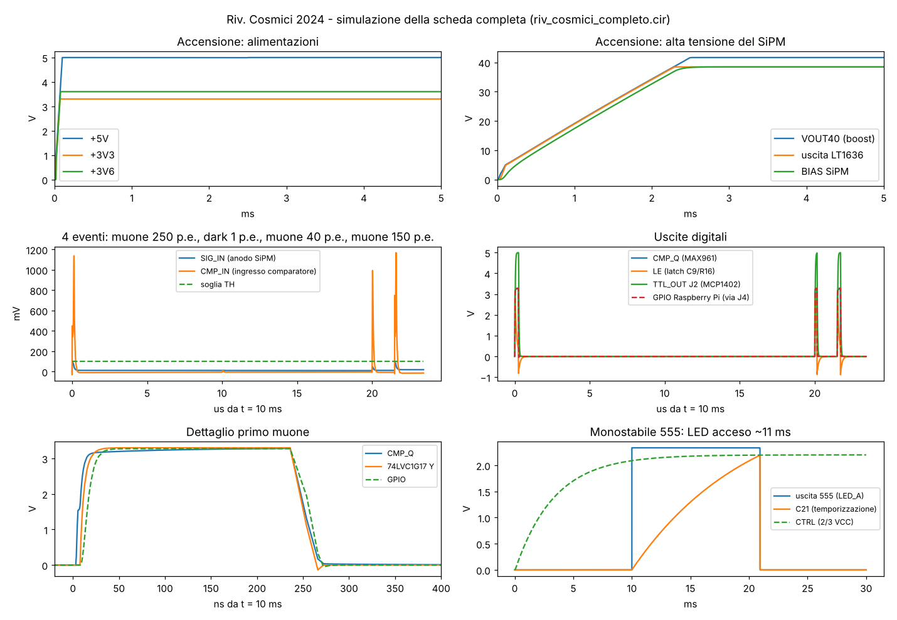

# glacier-elettronica — Rivelatore di raggi cosmici

Front-end di lettura per un **rivelatore di muoni cosmici** basato su SiPM +
scintillatore: amplificatore veloce, discriminatore a soglia regolabile,
generazione del bias del SiPM, uscita TTL e **uscita 3,3 V per Raspberry Pi**.

Ricostruzione completa in KiCad — dal solo PDF scansionato dello schema originale
INFN sez. Torino ("Riv. Cosmici 2024 — Amplif, alim, soglie", S. Gallian) —
accompagnata da simulazioni circuitali non lineari, un verificatore che gira
**direttamente dallo schema**, la **simulazione LTspice della scheda completa** e un
sito didattico interattivo.


## Come funziona il circuito

Un muone attraversa lo scintillatore e produce un lampo di luce; il **SiPM**
(AFBR-S4N22P014M, polarizzato a ~38,4 V generati a bordo) lo converte in un
impulso di corrente. Due transistor — **BFR93A** (Q1) e **MMBTH81** (Q2) —
amplificano di ~28×. Il comparatore **MAX961** confronta con la soglia impostata
dal trimmer V2 e produce l'impulso digitale **CMP_Q**; una rete C9/R16 (latch)
evita i doppi conteggi. Da qui il segnale va al driver **MCP1402** (uscita TTL su
J2) e al buffer **74LVC1G17** alimentato a 3,3 V, che lo porta sul connettore
LEMO/J4 a 0–3,3 V, pronto per un GPIO del **Raspberry Pi**. Un timer **555** accende un LED per
11 ms a ogni evento.

Rate reale su una paletta 10×10 cm a livello del mare: **~1,7 muoni/s**.

| Schema | PCB |
|---|---|
|  |  |

## Struttura del repository

```
hardware/          progetto KiCad (schema, PCB, librerie, Gerber, BOM)
  riv_cosmici.kicad_pro/.kicad_sch/.kicad_pcb
  riv.kicad_sym, rivlib.pretty/        librerie simboli e footprint del progetto
  gerber/, riv_cosmici_gerber.zip      Gerber RS-274X + Excellon (pronti per il fab)
  bom/                                 distinta base (.xlsx e .csv) con codici Farnell/RS
  PRIMA_DI_ORDINARE.md                 cosa e' verificato e cosa decidere prima dell'ordine
  jlcpcb/                              Gerber, BOM e CPL per PCB + montaggio su JLCPCB
  variante_3ch/                        VARIANTE A 3 CANALI + coincidenza AND, uscite LEMO
  render3d/                            render 3D delle schede montate (three.js)
  previews/                            anteprime PNG
  generator/                           script Python che GENERANO lo hardware (sorgente)
simulation/        modelli circuitali non lineari + verifica dallo schema
  ltspice/             SCHEDA COMPLETA per LTspice (.asc) e ngspice (.cir) + verifica
  sim_catena.py        catena di segnale (SiPM -> ampli -> comparatore)
  sim_muoni.py         treno di muoni (Poisson + Landau) + dark count
  sim_buffer.py        (variante superata) vecchio buffer a 2 transistor
  sim_treno_completo.py (variante superata) catena fino a un Arduino a 5 V
  netlist_from_kicad.py   estrae la netlist dal .kicad_sch
  verify_from_schematic.py simula DALLA netlist estratta (front-end + uscita)
  make_recap.py        genera il PDF di recap
  riv_cosmici_frontend.cir  netlist SPICE del solo front-end (storica)
  figures/             grafici generati
web/               sito didattico interattivo (single-file, offline)
firmware/          (variante superata) sketch Arduino
docs/              schemi in PDF (1 e 3 canali), RECAP_progetto.pdf, schema_originale_INFN.pdf
```

## Due versioni

| | Scheda a 1 canale | Variante a 3 canali |
|---|---|---|
| Dove | `hardware/` | `hardware/variante_3ch/` |
| Barre / SiPM | 1 | 3 (bias e soglia regolabili per canale) |
| Uscite | LEMO/header 3,3 V + TTL 5 V | 3 LEMO 00 (canali) + 1 LEMO 00 (AND) |
| Coincidenza | — | 74LVC1G11 con jumper di esclusione |
| Test point | — | 6 per canale + 6 comuni |
| PCB | 80 × 55 mm | 103 × 223,9 mm, serigrafia didattica, 8 fori M3 |
| Schema PDF | `docs/schema_riv_cosmici_1canale.pdf` | `docs/schema_riv_cosmici_3canali.pdf` |

Render 3D delle schede montate: `hardware/render3d/out/1ch/` e `out/3ch/`
(rigenerabili con `python scene.py 3ch && node shoot.mjs 3ch`).

## Hardware (KiCad)

Apri `hardware/riv_cosmici.kicad_pro` con **KiCad 6 o successivo**. Le librerie di
progetto (`riv.kicad_sym`, `rivlib.pretty`) sono già referenziate da `sym-lib-table`
e `fp-lib-table` con percorso `${KIPRJMOD}`. I Gerber in `hardware/gerber/` sono
pronti per la produzione (2 layer, 80×55 mm; DRC geometrico e connettività a zero
errori). La BOM in `hardware/bom/` riporta i codici d'ordine Farnell/RS trascritti
dal progetto originale.

### Prima di ordinare

Leggi **[`hardware/PRIMA_DI_ORDINARE.md`](hardware/PRIMA_DI_ORDINARE.md)**: elenca cosa è
stato verificato (schema = originale INFN pin per pin, piedinature sui datasheet, DRC e
connettività del PCB, simulazione della scheda intera) e i punti da decidere al
montaggio, che non richiedono modifiche al PCB: R3 per restare sotto i 40 V del
LT3461, i condensatori d'uscita dei regolatori, l'ingombro di L1 e il LEMO.

Rigenerare tutto (schema, PCB, Gerber, BOM, anteprime) dal modello dati:

```bash
cd hardware/generator
python gen_sch.py && python gen_pcb.py && python gerber_out.py && python gen_bom.py
python gen_jlcpcb.py   # dopo aver aggiornato hardware/gerber e lo zip
python render_sch.py && python render_pcb.py
# schema, PCB e Gerber escono in generator/riv_cosmici/: copiarli in hardware/
```

## Simulazioni

Tutto in Python puro (nessun SPICE richiesto): un solver MNA + Newton con transistor
Ebers-Moll. Installa le dipendenze e lancia gli script da `simulation/`:

```bash
pip install -r requirements.txt
cd simulation
python sim_catena.py          # risposta della catena, punto di lavoro DC
python sim_muoni.py           # treno di muoni + dark count, reiezione
python sim_buffer.py          # buffer: CMP_Q vs TTL, storage time
python sim_treno_completo.py  # end-to-end fino al pin Arduino
```

Risultati principali (dettaglio in `simulation/RISULTATI_SIMULAZIONE.md`):
guadagno ~35 mV/fotoelettrone, saturazione oltre ~40 p.e.; soglia regolabile da
~2 mV a ~1,3 V; 7 muoni → 7 conteggi con 46 dark count rigettati; rate medio
1,68 conteggi/s a scala reale.

### Simulazione LTspice della scheda COMPLETA

In `simulation/ltspice/` c'è tutta la scheda — alimentazioni, boost 40 V, bias del SiPM,
front-end, soglia, comparatore con latch, driver TTL, 555 + LED, uscita per il
Raspberry Pi — come **schema LTspice** (`riv_cosmici_completo.asc`, si apre e si preme
Run) e come netlist (`.cir`, anche per ngspice). È generata dallo stesso modello dati
dello schema KiCad: riferimenti e nomi delle reti coincidono.

```bash
cd simulation/ltspice
python verifica_ltspice.py   # .asc == .cir, copertura KiCad, 21 controlli, grafico
```



Dettagli, parametri e limiti dei modelli: [`simulation/ltspice/LEGGIMI.md`](simulation/ltspice/LEGGIMI.md).

### Verifica DIRETTA dallo schema

Le simulazioni normali usano una netlist trascritta a mano. Per legare la verifica
allo schema vero:

```bash
cd simulation
python verify_from_schematic.py            # front-end letto dal .kicad_sch
python verify_from_schematic.py --uscita   # + stadio d'uscita (U9 -> J4) dal .kicad_sch
```

`netlist_from_kicad.py` estrae la netlist per geometria direttamente dal file
`hardware/riv_cosmici.kicad_sch` (valori, fili, etichette, alimentazioni) e
`verify_from_schematic.py` la simula: il punto di lavoro coincide col riferimento al
millivolt, e un errore introdotto nello schema (valore o cablaggio) cambia il
risultato — così la simulazione diventa una vera verifica dello schema.

Il **PDF di recap** con tutti i grafici e i numeri si rigenera con:
`python make_recap.py` → `docs/RECAP_progetto.pdf`.

## Sito didattico

In `web/` ci sono pagine HTML autonome (funzionano offline, senza librerie
esterne), con dentro lo **stesso solver circuitale** portato in JavaScript:

- `schematico_interattivo.html` — lo schema elettrico "vivo": lancia un muone al
  rallentatore, sonde sui nodi, componenti cliccabili, trimmer della soglia
  trascinabile, oscilloscopio.
- `viaggio_del_muone.html` — la catena stadio per stadio, con i grafici ricalcolati
  in tempo reale.
- `rivelatore_cosmici.html` — cruscotto con muoni animati e conteggio.

## Lettura con Raspberry Pi

J4 pin 1 → un GPIO (es. GPIO17) con 330 Ω in serie, J4 pin 2 → GND. L'uscita è
0–3,3 V. Ogni muone dà un impulso di ≥ 84 ns: va contato **a interrupt sul fronte di
salita** (es. `libgpiod`, eventi `RISING_EDGE`), non in polling. **Non collegare J2**
(TTL a 5 V) al Pi. Lo sketch in `firmware/` è della vecchia variante Arduino a 5 V.

## Rigenerare lo hardware

Gli script in `hardware/generator/` sono il "sorgente" da cui sono stati generati
schema, PCB, Gerber e BOM (via codice, per costruzione riproducibile), tutti dallo
stesso modello dati `netdata.py`; i comandi sono nella sezione "Prima di ordinare".
Anche la simulazione LTspice (`simulation/ltspice/gen_ltspice.py`) parte da lì.

## Crediti e licenza

Progetto originale: **INFN sezione di Torino**, "Riv. Cosmici 2024 — Amplif, alim,
soglie" (S. Gallian, 2024). Ricostruzione KiCad, buffer, simulazioni, verifica e
materiale didattico: questo repository.

Rilasciato sotto **CERN Open Hardware Licence Version 2 — Weakly Reciprocal**
(CERN-OHL-W-2.0): vedi `LICENSE` e `LICENSE.CERN-OHL-W-2.0.txt`. Il software di
supporto (script Python/JS, firmware) è distribuito con lo stesso spirito.

## Monitor delle tensioni (scheda a 3 canali)

Un ADC MCP3424 sulla scheda legge i tre bias dei SiPM e l'alta tensione; il Raspberry Pi li legge in I²C con `software/monitor_tensioni.py`. Dettagli e verifica che non disturbi le misure: `hardware/variante_3ch/LEGGIMI.md` e `simulation/ltspice/verifica_monitor.py`.
