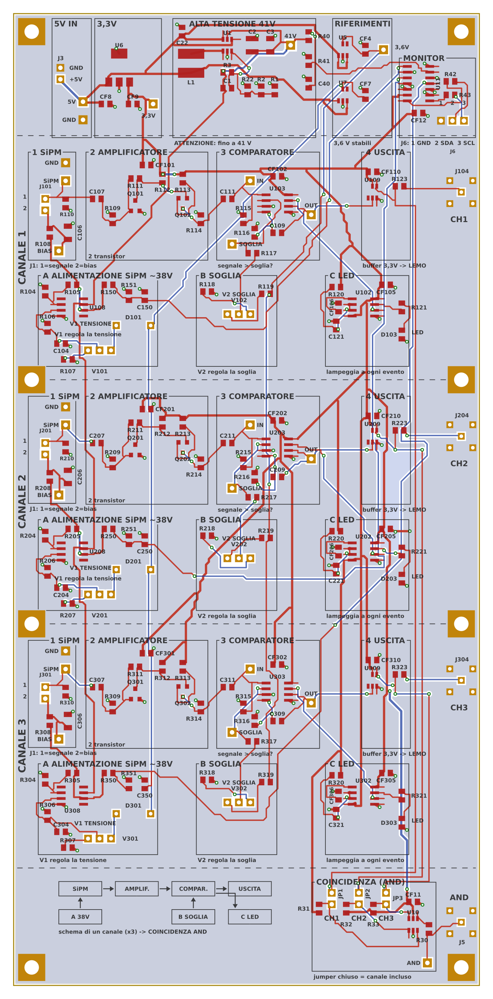

# Variante a 3 canali + coincidenza

Una sola scheda (103 × 215 mm, 2 strati, 8 fori di fissaggio M3) con **tre front-end completi** del rivelatore
INFN — uno per barra di scintillatore — e la **coincidenza AND** già a bordo.
Il PCB è pensato anche per **attività didattiche (STEM)**: è diviso in blocchi
funzionali con il nome scritto in serigrafia, e i test point sono accanto ai punti che
misurano.

| File | Contenuto |
|---|---|
| `riv_cosmici_3ch.kicad_pro/.kicad_sch/.kicad_pcb` | progetto KiCad (librerie in `../riv.kicad_sym`, `../rivlib.pretty`) |
| `gerber/`, `riv_cosmici_3ch_gerber.zip` | Gerber + foratura per la produzione |
| `BOM_riv_cosmici_3ch.csv` | distinta completa (anche le parti da montare a mano) |
| `jlcpcb/` | BOM e CPL per il montaggio JLCPCB (stessa procedura di `../jlcpcb/LEGGIMI.md`) |
| `../../docs/schema_riv_cosmici_3canali.pdf` | schema in PDF (A1) |
| `../render3d/out/3ch/` | render 3D della scheda montata |

Tutto è generato da `hardware/generator/` (`netdata3.py`, `gen_sch3.py`, `pcb_data3.py`,
`gen_pcb3.py`, `gen_variante3.py`) a partire dal modello della scheda a 1 canale: il
circuito di ogni canale è **identico** all'originale INFN.

## Com'è fatta (si legge dall'alto in basso)

| Fascia | Cosa c'è |
|---|---|
| **Alimentazione** (in alto) | `5V IN` (J3) → `3,3V` (U6) → `ALTA TENSIONE 41V` (U1, LT3461) → `RIFERIMENTI` 3,6 V (U5 soglie, U7 bias) → `MONITOR` (ADC delle tensioni, I²C) |
| **Canale 1, 2, 3** | riga alta = percorso del segnale da sinistra a destra: `1 SiPM` → `2 AMPLIFICATORE` → `3 COMPARATORE` → `4 USCITA` (LEMO sul bordo destro); riga bassa = circuiti di supporto sotto il blocco che servono: `A ALIMENTAZIONE SiPM ~38V` (V1), `B SOGLIA` (V2), `C LED` (555) |
| **Coincidenza** (in basso) | schema a blocchi di un canale in serigrafia; jumper JP1–JP3 → AND a 3 (U10) → LEMO J5 |
| **Lato saldature** | legenda "Come funziona" (testo specchiato, si legge girando la scheda) |

- Ogni canale ha **lo stesso piazzamento**, spostato di 54 mm: trovato un punto sul
  canale 1, è nello stesso posto sugli altri due.
- **Riferimenti**: R9 del canale 2 si chiama R209, U3 del canale 3 si chiama U303, ecc.
  Tutti i riferimenti sono stampati in serigrafia.
- Il circuito di ogni canale è **identico** all'originale INFN; tolto solo il driver TTL
  a 5 V (MCP1402, J2): le uscite sono LEMO a 3,3 V.

## Fori di fissaggio

8 fori **M3** (foro 3,2 mm metallizzato, piazzola 6 mm collegata a massa): ai quattro
angoli e sui due lati in corrispondenza del confine tra un canale e l'altro, a 4 mm dai
bordi. Per il montaggio su pannello bastano distanziali M3 da 10 mm (il trimmer più alto
è 10 mm). Le posizioni esatte sono in `hardware/generator/pcb_data3.py` (`MH_POS`) e si
possono controllare sul PDF in scala 1:1 (`stampa_1a1_riv_cosmici_3ch.pdf`).

## Uscite LEMO (bordo destro, dall'alto)

| LEMO | Segnale |
|---|---|
| J104 | canale 1 (0–3,3 V, 33 Ω in serie) |
| J204 | canale 2 |
| J304 | canale 3 |
| J5 | **coincidenza AND** dei canali inclusi (in basso) |

Footprint per **LEMO EPL.00.250.NTN** (presa a gomito da circuito stampato, serie 00):
contatto centrale + 4 piedini di schermo su quadrato 5,08 mm, fori 0,8 mm, frontale
verso l'esterno della scheda. **Prima dell'ordine, appoggia un LEMO vero sul disegno
del PCB in scala 1:1** e verifica fori e distanza dal bordo.

## Coincidenza e jumper JP1–JP3

U10 (74LVC1G11) fa l'AND delle uscite dei tre canali. Ogni ingresso passa da un jumper
(sulla scheda c'è scritto `CH1`, `CH2`, `CH3` sotto ciascuno). Le uscite dei canali
scendono alla coincidenza in un **corridoio riservato** lungo il bordo destro, senza
passare sopra i circuiti degli altri canali. I tre ingressi dell'AND sono equivalenti:
il canale 1 va al pin 3 (B), il 2 al pin 1 (A), il 3 al pin 6 (C), per avere piste
senza incroci.

| JP | Chiuso | Aperto |
|---|---|---|
| JP1 | canale 1 nella coincidenza | canale 1 escluso (ingresso tenuto a 1 da R31) |
| JP2 | canale 2 | escluso (R32) |
| JP3 | canale 3 | escluso (R33) |

Tutti chiusi = coincidenza tripla; JP3 aperto = coincidenza doppia 1·2, e così via.
Impulsi dei canali ≥ 84 ns (latch del MAX961): per muoni che attraversano le tre
barre i fronti arrivano entro pochi ns e gli impulsi si sovrappongono.

## Test point per oscilloscopio

Ogni test point ha il nome stampato accanto ed è **a pochi mm dal nodo che misura**:
le piste che li collegano sono corte e non fanno da antenna (nella versione precedente
i test point erano in colonna sul bordo e aggiungevano fino a 7 cm di pista
sull'ingresso dell'amplificatore).

| Canale n (stesse posizioni in ogni canale) | Scritta | Dove |
|---|---|---|
| TPn01 SIG_IN (anodo SiPM) | `SiPM` | accanto a J1 |
| TPn06 GND | `GND` | sopra TPn01: molla di massa della sonda |
| TPn05 BIAS (~38 V: attenzione) | `BIAS` | sotto il filtro R8/C6 |
| TPn02 CMP_IN (ingresso comparatore) | `IN` | accanto a U3 |
| TPn03 TH (soglia) | `SOGLIA` | accanto a R17 |
| TPn04 CMP_Q (uscita comparatore) | `OUT` | tra U3 e il buffer |

| Comuni | Scritta |
|---|---|
| TP1 VOUT40 (~41 V) | `41V` |
| TP2 +5V, TP6 GND | `5V`, `GND` (accanto a J3) |
| TP3 +3V3 | `3,3V` |
| TP4 +3V6 | `3,6V` |
| TP5 uscita AND | `AND` |

Fori da 1 mm: ci va un **pin di strip header** (tagliato dalla stessa strip 1×40 dei
connettori, costa quasi niente) oppure un anello Keystone 5000 (rosso) / 5001 (nero, GND).
Usa una sonda 10× con la molla di massa corta sul GND più vicino.

## Monitor delle tensioni (blocco `MONITOR`)

Un ADC **MCP3424** (U11, I²C, indirizzo 0x68) legge quattro tensioni e le passa al
Raspberry Pi dal connettore **J6**, Molex KK 254 a 3 poli con aggancio (1 GND, 2 SDA, 3 SCL; le pull-up sono quelle del Pi):

| Ingresso ADC | Cosa misura | Partitore |
|---|---|---|
| CH1, CH2, CH3 | uscita del regolatore del bias (VREG38) dei canali 1, 2, 3 | R150/R151, R250/R251, R350/R351 (1 MΩ / 43 kΩ) + C?50 100 nF |
| CH4 | alta tensione (41 V) | R40/R41 (1 MΩ / 43 kΩ) + C40 100 nF |

Lettura: `software/monitor_tensioni.py` (stampa e salva in CSV una volta al secondo).
Risoluzione a 16 bit: 62,5 µV all'ADC = **1,5 mV sul bias**. Con resistenze all'1 % la
lettura assoluta va tarata una volta col multimetro sul test point BIAS (fattore `CAL`
nello script); dopo, si vedono bene anche le variazioni del bias con la temperatura
(~28 mV/°C, la compensazione del diodo D1).

### Perché non disturba le misure

- **Si misura VREG38, non BIAS.** VREG38 è l'uscita dell'op-amp U?08, dentro il suo
  anello di retroazione (R5/R4): i 37 µA del partitore non ne cambiano la tensione, e
  quindi nemmeno quella del SiPM. Tra il partitore e il SiPM resta il filtro R8/C6.
- **Nessun disturbo verso il SiPM.** Il partitore è da 1 MΩ e il punto di misura ha
  100 nF verso massa: gli impulsi di campionamento dell'ADC finiscono nel condensatore,
  e quello che risale fino a VREG38 è attenuato di oltre un milione di volte, prima
  ancora del filtro R8/C6.
- **Le piste verso l'ADC sono "ferme".** Portano una tensione continua di ~1,6 V con
  100 nF all'estremo del canale: non fanno da antenna.
- **Il digitale è lontano e lento.** ADC e connettore sono nella fascia alimentazione,
  lontani dagli amplificatori; le resistenze da 100 Ω in serie su SDA/SCL addolciscono i
  fronti. L'ADC lavora "one-shot": converte solo quando il Pi glielo chiede (una volta
  al secondo) e per il resto è fermo.
- **Carico trascurabile.** 4 × 37 µA in più sull'alta tensione (il survoltore ne dà
  qualche mA).
- **In caso di guasto** (alta tensione a 45 V) all'ADC arrivano 1,86 V, sotto il suo
  fondo scala di 2,048 V e lontano dal limite di alimentazione.

**Non misuriamo la corrente del SiPM.** Si potrebbe ricavare dalla caduta su R8 (1 kΩ),
ma con 0,1–1 µA di corrente di buio sono 0,1–1 mV su 38 V: l'errore dei partitori (1 %
di 38 V = 380 mV) la coprirebbe del tutto. Servirebbe un amplificatore dedicato vicino al
SiPM, cioè proprio sul nodo più delicato: non ne vale la pena.

## Montaggio

JLCPCB monta 147 componenti (`jlcpcb/`). **A mano** (non in BOM/CPL):

| Rif. | Parte | Per scheda |
|---|---|---|
| U1 | LT3461 | 1 |
| U103, U203, U303 | MAX961 | 3 |
| U108, U208, U308 | LT1636 | 3 |
| U5, U7 | LP2985AIM5-3.6 | 2 |
| D101, D201, D301 | 1N4148 | 3 |
| J101, J201, J301 | Molex KK 254 22-27-2021 (cavo barra: 22-01-3027 + 2× 08-50-0114; pin 1 = centrale/segnale, pin 2 = calza/bias) | 3 |
| J3 | header 1×2 (5 V) | 1 |
| J6 | Molex KK 254 3 poli 22-27-2031 (I²C verso il Raspberry Pi; cavo: 22-01-3037 + 3 contatti 08-50-0114) | 1 |
| JP1–JP3 | header 1×2 + ponticello | 3 |
| J104, J204, J304, J5 | LEMO EPL.00.250.NTN | 4 |
| TP* | test point (pin di strip header) | 24 |

Ordine Farnell per 5 schede (con scorta): `ordine_farnell.csv`.

Prima accensione: come per la scheda singola (`../PRIMA_DI_ORDINARE.md`), un canale
alla volta: alimentazioni → U1 → per ogni canale U?08 (regola il bias **senza SiPM**)
→ U?03 (regola la soglia) → SiPM. Per i punti da decidere (R3 = 255k, 2,2 µF su CF4,
CF7, CF9) valgono le stesse note della scheda singola.

## Verifiche fatte

- Schema: netlist riletta dal `.kicad_sch` per geometria = modello dati (0 differenze).
- PCB: autorouter + DRC geometrico + connettività: **0 errori**.
- **Verifica con KiCad 7** (`generator/verifica_kicad.py`, vedi `../PRIMA_DI_ORDINARE.md`):
  netlist dello schema estratta da KiCad = reti del PCB, DRC di KiCad senza errori
  (solo avvisi di serigrafia e uscite corte dai pin), 0 reti spezzate sul rame reale.
- Piste corte e uguali nei tre canali (mm): ingresso SiPM 9, ingresso comparatore 18,
  soglia 16–24, bias 9–11, uscita comparatore 26–28.
- Serigrafia: testo alto almeno 0,9 mm (tratto ~0,17 mm), mai sopra i pad; generata da
  `silk3.py` e identica in KiCad (`gr_poly`) e nei Gerber.
- Non ancora fatto: simulazione SPICE della scheda a 3 canali (il canale è identico a
  quello simulato in `simulation/ltspice/`); ERC di KiCad (la versione 7 non lo fa
  da riga di comando: il confronto delle netlist sopra copre i collegamenti).
